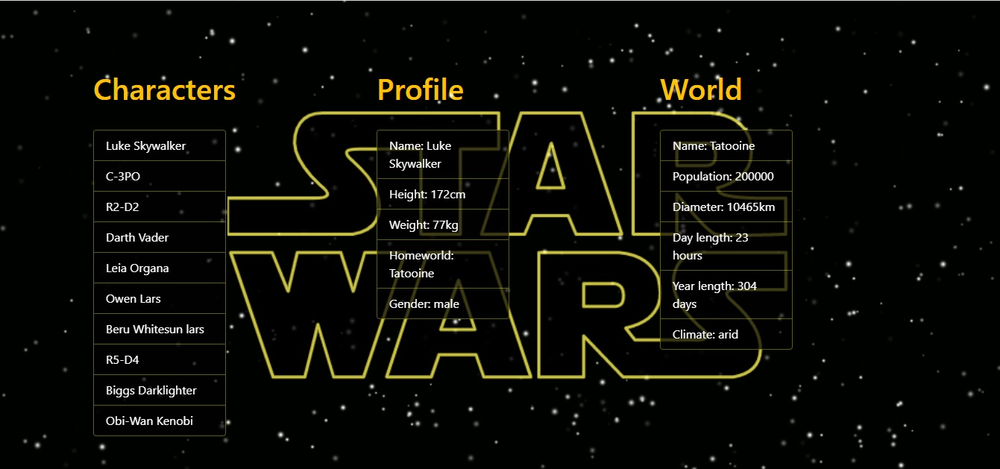

# Star Wars Redux

O Star-wars-redux é um projeto feito para o estudo de React.

  
  

## Índice
* [Sobre o projeto](#sobre-o-projeto)
* [Tech](#tecnologias)
* [Screenshots](#screenshots)

## Sobre o projeto
É uma aplicação em React que se alimenta da  e retorna as informações sobre o universo de Star Wars.

	
## Tecnologias
Atualmente rodando com:

- [x] ReactJS
- [x] BootStrap
- [x] Redux

## Screenshots

